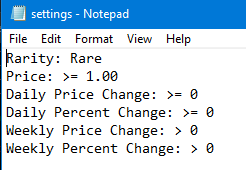

# 
## Notice!
This is a work in progress. 

Please assume there will be issues (though I hope you won't encounter any). I will triage issues as I receive them. 

Thanks!

## TLDWTR (Too Long Don't Want To Read)
* Step 1: Download Python
* Step 2: Download or fork code
* Step 3: Download pip
* Step 4: Open a cmd prompt/powershell, navigate to the bot's folder, and run "pip install -r requirements.txt"
* Step 4: Edit single_card_list.txt with your single cards and price thresholds
* Step 5: Edit price_lists with your format
* Step 6: Edit your price_lists thresholds in settings.txt (optional)
* Step 7: Automate your code (optional)
* Step 8: Setup email in email_settings.py (optional)
* Step 9: Enjoy!

## Purpose and Goals:
   
Automate a card popularity script that tracks and alerts the user to different price trends based on publicly available price lists and cards, with the goal being that the user will better predict increases/decreases in cards to help the purchasing process.

* Goal 1: Make tracking as streamline, easy to understand, and hands off as possible. Anybody, regardless of coding history, should be able to setup this script fully automated in 5-10 mins (you shouldn't have to ever look at code!)
* Goal 2: Provide a free to use "all-in-one" service that magic players or investors can use to realiably, efficiently, and sensibly track their current collection or potential purchases

Please feel free to dm if you feel I can improve upon either of these goals.

## Intro & Features:
I had initially started this code around two years ago and have since added a ton of features! If you are interested in taking a look at the old code you check out the original code here:  https://github.com/VanZandtr/mtgbot/commit/15a8802cf50556eb99fc6bcae25cdb2f7ca8ef9b and the original reddit post here: https://www.reddit.com/r/mtgfinance/comments/avhbpa/i_created_a_trending_bot/

This Bot can:
* Track individual cards of any type (extended, foil, promo, etc.) given an MTGGoldfish link
* Display pop-up messages when an individual cards has reached a certain threshold
* Track MTGGoldfish set/format price list
* Track certain set/format list cards based on 6 factors given by MTGGoldfish: Rarity, price, daily price change, daily percent change, weekly price change, weekly percent change
* Write individual and list cards to seperate excel files
* Be easily automated into background process for "hands off" card tracking
* Email you your price lists
* Display pop-up error message to easily trouble shoot your issues

# Initial setup:

## Python
Download Python here: https://www.python.org/downloads/

## pip
pip is a package manager for Python and allows my program to use complex libraries for sending emails, editing excels, etc.
Download pip here if it doesn't come with your python download: https://pip.pypa.io/en/stable/installing/

### Installing requirements with command prompt / powershell
* Open bot folder
* *Shift + Right Click* in the folder menu and open command prompt / powershell
  
* Run "pip install -r requirements.txt" to download all my packages

# Lists setup and usage:
## Single Card Setup:
   * Step 1: Obtain links to cards (e.g. https://www.mtggoldfish.com/price/Limited+Edition+Alpha/Black+Lotus#paper)  
   * Step 2: Paste links into single_card_list.txt making sure each card is on a new line  
   * Step 3: Add threshold values to the end of each card (valid operators: <, >, <=, >=, = or ==)(optional)  
   
   * Step 4: Run code and find my_list_report excel in /excels  
     
   * Multi Day (7 Days): 
   
   * Note 1: The above prices are mocked to demo a week of running the code (tinder wall is not a 3$ card) 
   * Note 2: if a price reaches a threshold a pop-up message will be displayed 
   
   
## Price List Setup:
   * Step 1: Obtain links to the lists (e.g. https://www.mtggoldfish.com/index/modern#paper)  
   * Step 2: Paste links into price_lists.txt making sure each list is on a new line  
   
   * Step 3: Add threshold values to the setting.txt file (valid operators: <, >, <=, >=, = or ==)(optional)  
   
   * Step 4: Run code and find excel in /excels
   
   * Note 1: If a card does not adhere to the settings you provide it will not show up in the excel file  
     

 ## Automation Setup (Windows):
   * Step 1: Open a command prompt (I'm using git bash here)
   * Step 2: Find your python path with: "python -c "import sys; print(sys.executable)"
     
   * Step 3: Create a new task in task scheduler
     
   * Step 4: Add additional timing settings to the created task
   
   
   Refer to this link for more information:  
   https://www.youtube.com/watch?v=n2Cr_YRQk7o
   
 
 ## Email Setup:
   * Step 1: Enable less secure apps with app passwords (https://support.google.com/accounts/answer/185833?hl=en)
   * Step 2: Edit /files_to_change/email_settings.txt
   
   
   
   
 ## Files:
 * mtgbot.py: main file with all the code
 * single_card_list.txt: text file to hold single cards and threshold operators and price values
 * price_lists.txt: text file to hold multicard lists
 * settings.txt: text file that holds threshold operators and price/percent values for multicard lists
 * email_settings.txt: file where email information is stored
 * /excel folder: folder where all the excel files are put from mtgbot.py
 * /pics: pictures for this Readme (you can delete this lol)
 * /files_to_change: all files the user can/should change
  
## Future Changes:
(Determined by poll tbd)

## Preemptive FAQs:
Q1: What mtggoldfish price does the bot use?  
A1: The Bot will try TCGPlayer Market first, then TCGPlayer Mid, then Card Kingdom, then eBay Buy It Now. Cards will not show some of these values if none exist for them, thus the need for "waterfall" style check system. I could add all in the future, but for now this is a bit cleaner.  

Q2: Can I run both single cards and multicard lists at the same time?  
A2: Yep!

Q3: I see I can only run the single card list once, why?  
A3: This is an intentional by design as MTGGoldfish doesn't update their prices but once a day. However if you remove or add a new card/price list to your lists you can rerun your program without the "Already ran today" message. 

Q4: Why wouldn't I just use site x, y, or z?  
A4: By all means use those sites (I probably do too)! I'm sure every one of those sites has advantages over (and much more color than) mine, but the goal here (restating from above) was to create a bot which could keep track of multiple cards and lists simulataneously which would spit out reusable excel sheets and emails all while running in the background. Simply log into your computer and your top level card analytics and notifications are already running!  

Q5: I have an issue, question, or suggestion.  
A5: No problem! Feel free to direct message me on reddit at /u/Albus_Lupi. Thanks for taking a look!

## Known Issues:
### AttributeError: 'ToastNotifier' object has no attribute 'classAtom'
Problem Explaination: This issue is caused by a program crashing/quiting mid pop-up ("toast") notification.  
Solution: If you are running from a IDE, a restart to reset object instances worked for me.  

# Contributors & Testers:
## Get your name here! Take the poll at: https://forms.gle/9hmAjysgkNG8MMLv9

/u/your_reddit_name_here_pog
